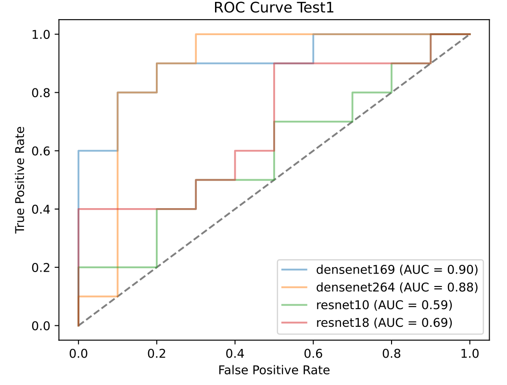
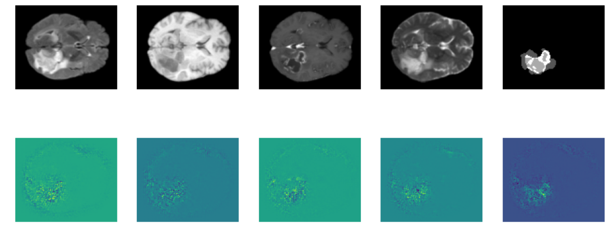

# Preoperative differentiation of Glioblastoma and Lymphoma using Deep Learning


## Abstract
Glioblastoma and lymphoma are challenging to differentiate due to their similar morphology, making preoperative MRI diagnosis often equivo-
cal. Accurate differentiation is crucial due to different treatment pathways,
and the use of corticosteroids in lymphoma complicates pathological diag-
nosis. Neural networks, particularly convolutional neural networks, show
promising results, but their black-box nature raises concerns about inter-
pretability and explainability, which is essential for general data protection
regulation compliance in clinical settings. While previous studies have in-
vestigated deep learning for brain tumor differentiation, interpretability
and explainability have not been sufficiently explored. This work presents
a deep learning approach for glioblastoma and lymphoma differentiation
using histopathological diagnosis as ground truth. The aim is to develop
a clinician decision support system and to investigate interpretability and
explainability using saliency maps, Monte Carlo dropout and deep ensem-
bles. The model achieved an area under the receiving operative character-
istics curve of 0.9 and an accuracy of 0.8, outperforming the average radiol-
ogist’s accuracy of 0.79. However, challenges remain, including robustness,
shifts in data distribution and clinical usability. Future work should ad-
dress these issues to facilitate the clinical implementation of deep learning
based tumor differentiation.

## Results



Figure 1: ROC curve from the original publication of the initial balanced test data set.



Figure 2: Saliency maps of the original publication of the initial balanced test data set.

## Pre-requesites:

* Linux (Tested on Ubuntu 22.04)
* NVIDIA GPU (Tested on Nvidia GeForce RTX 2080 Ti x 12 on local workstations)
* Python (3.10), nibabel (5.1.0), torch (2.1.2), monai (1.2.0), numpy (1.24.3), tqdm (4.62.3), scikit-learn (1.3.0), matplotlib (3.4.3).

### Basic, Fully Automated Run
``` shell
python main.py --batch_size 1 --path /your/path/to/the/data --seed 42 --model /Path/To/Model --device cuda 
```


### Datasets
Please structure your dataset as follows:
```bash
        path/
                ├── Glioblastom
                        ├── img_caseG1_0000.nii.gz (FLAIR)
                        ├── img_caseG1_0001.nii.gz (T1)
                        ├── img_caseG1_0002.nii.gz (T1ce)
                        ├── img_caseG1_0003.nii.gz (T2)
                        ├── img_caseG1_seg.nii.gz (segmentation)
                        ├── img_caseG2_0000.nii.gz (FLAIR)
                        ├── img_caseG2_0001.nii.gz (T1)
                        ├── img_caseG2_0002.nii.gz (T1ce)
                        ├── img_caseG2_0003.nii.gz (T2)
                        ├── img_caseG2_seg.nii.gz (segmentation)
                        └── ...
                └── Lymphom
                        ├── img_caseL1_0000.nii.gz (FLAIR)
                        ├── img_caseL1_0001.nii.gz (T1)
                        ├── img_caseL1_0002.nii.gz (T1ce)
                        ├── img_caseL1_0003.nii.gz (T2)
                        ├── img_caseL1_seg.nii.gz (segmentation)
                        ├── img_caseL2_0000.nii.gz (FLAIR)
                        ├── img_caseL2_0001.nii.gz (T1)
                        ├── img_caseL2_0002.nii.gz (T1ce)
                        ├── img_caseL2_0003.nii.gz (T2)
                        ├── img_caseL2_seg.nii.gz (segmentation)
                        └── ...
```
where G1 or L1 are the identifiers for the subjects. Each subject is expected to have all four modalities available 0000, 0001, 0002, 0003 and a segmentation.


## License
This project is made avialble under the CreativeCommons License. See the (LICENSE.md) file for more details.
## Reference
If you find our work useful in your research or use parts of this code please consider citing our paper:
```
@article{GlioLymphDifferentiation,
  title={Development of a deep-learning model for the preoperative diagnosis of Primary Central Nervous System Lymphoma},
  author={Paul Vincent Naser, Miriam Cindy Maurer, Maximilian Fischer, Kianush Karimian-Jazi, Chiraz Ben-Salah, Awais Akbar Bajwa, Martin Jakobs, Jessica Jesser, Martin Bendszus, Klaus Maier-Hein, Sandro M. Krieg, Peter Neher, Jan-Oliver Neumann},
  journal={iScience},
  year={2024},
  publisher={iScience}
}
```

